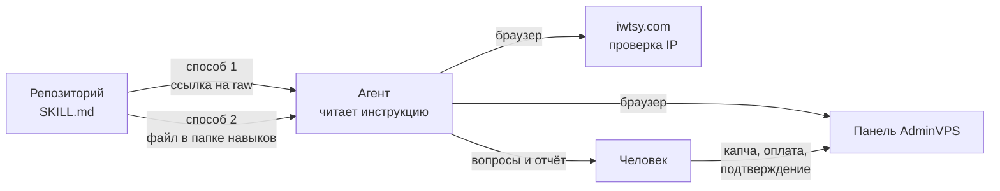
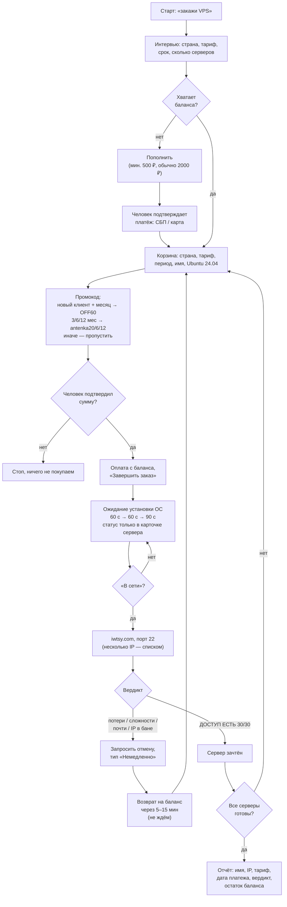

# adminvps-vps-order — покупка VPS руками ИИ-агента

Инструкция-навык: агент сам заказывает виртуальный сервер на AdminVPS, дожидается установки Ubuntu, проверяет «чистоту» IP через [iwtsy.com](https://iwtsy.com) и, если IP плохой, сдаёт сервер обратно и берёт другой — по кругу, пока все серверы не окажутся годными.

Файл навыка: [`skills/adminvps-vps-order/SKILL.md`](skills/adminvps-vps-order/SKILL.md)

---

## Как отдать навык агенту

Два способа, оба рабочие. Выбор зависит от того, умеет ли твой агент ходить в интернет.

### Способ 1 — дать ссылку (30 секунд, ничего не скачивать)

Скинь агенту одно сообщение:

```
Прочитай инструкцию по ссылке и работай строго по ней:
https://raw.githubusercontent.com/anten-ka/adminvpsbuyserver/adminvpsbuyserver/skills/adminvps-vps-order/SKILL.md

Задача: закажи VPS в Финляндии, тариф Promo, на месяц.
```

Ссылка ведёт на «сырой» markdown — агент прочитает её целиком одним запросом. Подходит для Claude, ChatGPT с браузером, Cursor, Perplexity и любого агента с доступом в сеть. Ограничение: инструкция живёт только в этом диалоге, в новом чате ссылку надо давать заново.

### Способ 2 — положить файл в папку навыков (один раз и навсегда)

Скачай `SKILL.md` и положи по нужному пути:

| Агент | Куда класть |
|---|---|
| Claude (Cowork, Claude Code) | `~/.claude/skills/adminvps-vps-order/SKILL.md` |
| ChatGPT | Проект → «Инструкции проекта» → вставить текст файла целиком |
| Cursor / Cline / свой агент на API | В системный промпт или в папку правил проекта |

После этого навык подхватывается сам по фразе «закажи сервер в Швейцарии на 3 месяца» — вызывать по имени не нужно. Это правильный способ, если задача повторяющаяся.

Быстрое скачивание в терминале:

```bash
mkdir -p ~/.claude/skills/adminvps-vps-order
curl -o ~/.claude/skills/adminvps-vps-order/SKILL.md \
  https://raw.githubusercontent.com/anten-ka/adminvpsbuyserver/adminvpsbuyserver/skills/adminvps-vps-order/SKILL.md
```

### Как это устроено



Агенту нужен **инструмент управления браузером** — без него навык бесполезен: вся работа идёт кликами в личном кабинете хостера. У Claude это расширение Claude in Chrome или встроенный браузер, у ChatGPT — агентный режим, у своего агента — Playwright или подобное.

---

## Схема работы навыка



Ключевое в схеме — петля `проверка → отмена → новый заказ`. Именно она отличает навык от «просто купи сервер»: грязный IP отсекается до того, как ты начнёшь что-то на нём разворачивать.

---

## Что агент делает сам, а что оставляет человеку

| Делает агент | Делает человек |
|---|---|
| Вход в кабинет, выбор страны и тарифа | Капча на логине и регистрации |
| Конфигурация сервера, имя, ОС, период оплаты | Подтверждение платежа: СБП, 3-D Secure, банковское приложение |
| Промокод, оформление заказа, оплата **с баланса** | Ввод номера карты и любых платёжных данных |
| Ожидание установки, проверка IP, отмена плохого сервера | Финальное «да» на сумму и конфигурацию заказа |

Агент **никогда** не вводит карту и не пересылает пароли в чат.

---

## Как подключить

### Claude (Cowork или Claude Code)

Положить папку навыка в каталог скиллов:

```
~/.claude/skills/adminvps-vps-order/SKILL.md
```

Дальше он подхватывается сам по фразе вроде «закажи VPS в Финляндии на месяц» — или вызывается явно: `/adminvps-vps-order`.

Нужен подключённый браузер: расширение Claude in Chrome либо встроенный браузер приложения. Без браузера навык бесполезен — вся работа идёт через панель хостера.

### ChatGPT

Своего формата скиллов у ChatGPT нет, поэтому содержимое `SKILL.md` вставляется как инструкция:

- **Проект** → «Инструкции проекта» — весь текст файла целиком, дальше в чатах проекта просто «закажи сервер в Швейцарии на 3 месяца»;
- либо **своя GPT** → поле «Instructions»;
- либо первым сообщением в обычном чате: «Действуй строго по этой инструкции: ‹текст файла›».

Кликать по сайту ChatGPT сможет только в режиме, где у него есть браузер (агентный режим / браузер Atlas). В обычном чате он отработает как пошаговый суфлёр: будет диктовать, что нажать, и разбирать результаты проверки IP — покупку придётся кликать самому.

### Другой агент (Cursor, Cline, свой на API)

`SKILL.md` — обычный markdown, кладётся в системный промпт. Требования к среде всего два:

1. инструмент управления браузером (Playwright, Puppeteer, browser-use, MCP-браузер) — навык написан под работу с DOM (`find`/`read_page`/клик по ссылке), а не под слепые клики по координатам;
2. возможность задавать уточняющие вопросы человеку до покупки.

Блок «Инструменты» в начале файла завязан на инструменты Claude — при переносе замените названия на свои, логика шагов не меняется.

---

## Рекомендации

**Про деньги.** Навык покупает всегда **с баланса**, а не картой. Это главная защита: агент может потратить только то, что вы заранее положили. Держите на балансе сумму под задачу (2000 ₽ — рабочий минимум под 3–4 сервера Promo) и не привязывайте карту к автопродлению, если не хотите сюрпризов.

**Про подтверждение.** Правило «показать итоговую строку и дождаться да» — не формальность. Именно на этом шаге ловятся годовая оплата вместо месячной (конфигуратор AdminVPS открывается с годом по умолчанию) и лишний сервер в корзине.

**Про отмену.** Отмену сервера с плохим IP агент делает сам, без переспроса — иначе цикл «купил → проверил → заменил» не работает. Поэтому в кабинете держите боевые серверы под узнаваемыми именами: навык обязан сверить имя и IP перед нажатием и не трогать ничего, что не заказывал в этой сессии.

**Про проверку IP.** Проверять только через iwtsy.com и только после того, как ОС встала. Прямой SSH со своей машины под включённым VPN покажет «порт открыт» на любом, даже забаненном IP — и вы заедете на грязный сервер.

**Про промокоды.** `OFF60` работает только у новых клиентов. На аккаунте, где уже есть услуги, при месячной оплате скидок нет вообще — не тратьте на это шаги. Коды `antenka20` / `antenka6` / `antenka12` работают у всех, но требуют оплаты за 3 / 6 / 12 месяцев.

**Про время.** Два сервера от начала до отчёта — 4–5 минут. Серверы поднимаются за 1,5–3 минуты; если агент ждёт дольше пяти, он, скорее всего, обновляет список услуг вместо карточки сервера — там статуса установки нет.

**Про безопасность.** Заводите под агента отдельный аккаунт хостера, если работаете не со своим. Пароли серверов не просите присылать в чат — они всегда доступны в карточке сервера.

---

## Ограничения

- Логика привязана к вёрстке личного кабинета AdminVPS (WHMCS). При редизайне ломаются шаги 4–6 — чинится правкой названий кнопок в файле.
- Капча и подтверждение платежа не автоматизируются принципиально.
- Реферальные ссылки и промокоды в файле — клуба Anten-ka; при использовании вне клуба замените на свои.
