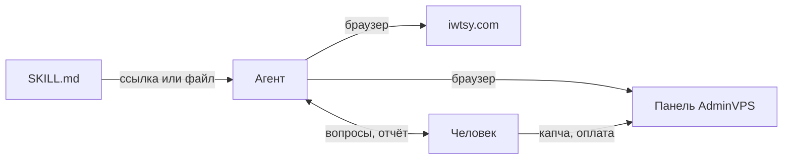
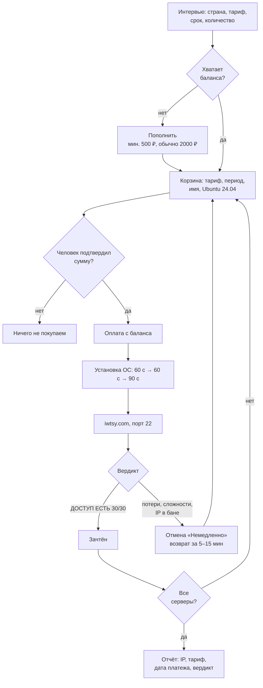

# adminvps-vps-order — покупка VPS руками ИИ-агента

Инструкция для ИИ-агента: заказать сервер на AdminVPS, дождаться установки ОС и проверить, пробивается ли его IP из России. Плохой IP — сервер сдаётся обратно и берётся новый, пока все не окажутся годными.

Файл навыка: [`skills/adminvps-vps-order/SKILL.md`](skills/adminvps-vps-order/SKILL.md)

## Как отдать агенту

**Ссылкой** — одно сообщение, ничего не скачивать. Работает с любым агентом, у которого есть интернет; живёт только в текущем диалоге.

```
Прочитай инструкцию по ссылке и работай строго по ней:
https://raw.githubusercontent.com/anten-ka/adminvpsbuyserver/adminvpsbuyserver/skills/adminvps-vps-order/SKILL.md
```

**Файлом** — один раз и навсегда, навык сам подхватывается по фразе «закажи сервер в Швейцарии на 3 месяца».

| Агент | Куда положить |
|---|---|
| Claude (Cowork, Claude Code) | `~/.claude/skills/adminvps-vps-order/SKILL.md` |
| ChatGPT | Проект → «Инструкции проекта» → текст файла целиком |
| Cursor, Cline, свой на API | Системный промпт или папка правил проекта |

```bash
mkdir -p ~/.claude/skills/adminvps-vps-order
curl -o ~/.claude/skills/adminvps-vps-order/SKILL.md \
  https://raw.githubusercontent.com/anten-ka/adminvpsbuyserver/adminvpsbuyserver/skills/adminvps-vps-order/SKILL.md
```

Агенту обязательно нужен **браузерный инструмент** — вся работа идёт кликами в панели хостера. У Claude это Claude in Chrome или встроенный браузер, у ChatGPT — агентный режим, у своего агента — Playwright или аналог. Без него агент годится только как суфлёр: продиктует шаги и разберёт результат проверки, кликать будешь сам.



## Как работает



Три места, где навык отличается от «просто купи сервер»:

- **Порог годности жёсткий.** Годен только вердикт «ДОСТУП ЕСТЬ» на всех 30 нодах. «Работает с потерями» — уже брак, сервер сдаётся.
- **Проверка только снаружи.** Прямой SSH со своей машины под VPN показывает «порт открыт» даже на забаненном IP. Поэтому [iwtsy.com](https://iwtsy.com) — сеть нод у российских провайдеров, которая видит, где именно рвётся: порт закрыт, пакеты не доходят или DPI режет handshake.
- **Петля замены.** Отмену агент делает сам и сразу берёт следующий сервер, не дожидаясь возврата денег.

## Кто что делает

| Агент | Человек |
|---|---|
| Вход, выбор страны и тарифа, конфигурация | Капча на логине |
| Промокод, заказ, оплата **с баланса** | Подтверждение платежа: СБП, 3-D Secure |
| Ожидание установки, проверка IP, отмена брака | Финальное «да» на сумму заказа |

Карту агент не вводит никогда, пароли серверов в чат не пересылает.

## Что важно знать

- **Деньги.** Покупка только с баланса — агент потратит ровно то, что ты положил заранее. 2000 ₽ хватает на 3–4 сервера Promo с запасом на замену.
- **Подтверждение — не формальность.** На этом шаге ловится годовая оплата вместо месячной: конфигуратор AdminVPS открывается с годом по умолчанию (5389 ₽ вместо 499 ₽).
- **Промокоды.** `OFF60` — только новым клиентам. На аккаунте с услугами при месячной оплате скидок нет вообще. `antenka20` / `antenka6` / `antenka12` работают у всех, но требуют оплаты за 3 / 6 / 12 месяцев.
- **Отмена без переспроса.** Иначе цикл не работает. Держи боевые серверы под узнаваемыми именами — навык обязан сверить имя и IP перед нажатием.
- **Время.** Два сервера от начала до отчёта — 4–5 минут. Дольше пяти обычно значит, что агент обновляет список услуг вместо карточки сервера: статуса установки в списке нет.

## Ограничения

- Шаги 4–6 завязаны на вёрстку личного кабинета (WHMCS) — при редизайне правятся названия кнопок в файле.
- Капча и подтверждение платежа не автоматизируются принципиально.
- Реферальные ссылки и промокоды — клуба Anten-ka; вне клуба замени на свои.
